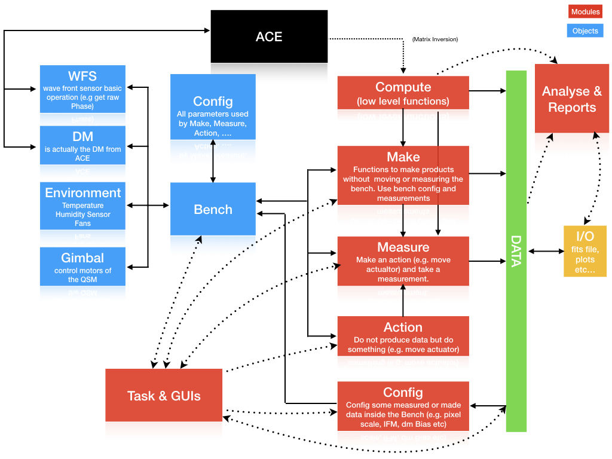

---
title: "Overview of Naomi Bench Software"
author: "Sylvain Guieu"
output:
  rmarkdown::pdf_document:
    fig_caption: yes        
    includes:  
      in_header: figure_placement.tex
---

# Introduction 

The goal of the  Naomi Calibration Bench Software (NCBS) is to offer a simple way to calibrate 
the DM mirror interaction matrix and the DM BIAS used by Sparta. The software should 
handle: 

- The mirror alignment 
- The control of the temperature inside the calibration climatic chamber
- An automatised calibration process followed by several check on the integrity of the calibration products 
- The creation of a report showing all the quality check (QC) parameters, key results and key figures 
to control the good health of the DM and the quality of the newly created interaction matrix.

On top of that the software has been layered in order to provide both basic actions with 
the DM and adaptative optics operation  and more advanced tasks and an efficient user interface. 
The law level core of the 
software is based on the [ACE] Matlab software (furnished by Alpao). The ALPAO [ACE] software
allows to communicate with the DM, with the Haso wave front sensor and to compute matrix inversion. 
The [ACE] drove our choice to build the NCBS with Matlab.

# Architecture

The architecture of the NCBS was driven, on top on the core tasks exposed above, by several ideas 

- Provide low level function independent of Naomi environment, e.g. function to make 
  interaction matrix from an Influence Matrix function, to clean Tip/Tilt from an phase screen 
  array etc. These function takes as many input argument has necessary. 
- Offline analyses. The ability to analyse raw data, to (re)build intermediate data, makes plot, report etc without 
  the need to have the bench started (DM, wave front, etc ...). The data produced and recorded on disk (fits file) must have all the necessary information for off line analysis (environment parameters, measurement configuration, alignment parameters, etc...). 
- Build high level functions to make complex tasks with the DM with a very few number of 
  arguments. Such tasks are, for instance, Influence Matrix measurement, Closing loop, etc...
  Arguments are included in a bench configuration object. 
  
The figure bellow shows the global structure of the bench. The blues boxes are the control command objects, 
the red boxes are  modules (containing a set of function). The green box represent data which
can be Matlab value or array or `naomi.data` objects. These object contain data, keywords and limited
methods to plot and analyse the data its contain.

The modulate `task` provide the highest function levels. They provide to the operator 
ways to run some bunch of calibration and save them automatically without any arguments. 
Such are `naomi.task.calibrate;` which calls `naomi.task.IFM` (measure an IFM), `naomi.task.ZtC` (make the zernike to command matrix), `naomi.task.dmBias` (make the dm Bias) etc ...  Name of these tasks are usually self explained like `naomi.task.openEngineeringPanel`.

The GUIs interface are on top of the tasks and provide a way to execute them with a user interface. The two mains GUI interfaces that pop-up at startup are the startup panel
and the calibration panel. From them the operator can make all the alignment and calibration 
necessary. 

 

    
  

  
  
   

[ACE]: https://www.alpao.com/adaptive-optics/ao-softwares.html